# Diagramme de classes — Unsteamed

```mermaid
classDiagram
    direction TB

    %% ════════════════════════════════════════════════════════════════════
    %% Package: com.saumon
    %% ════════════════════════════════════════════════════════════════════

    class Main {
        +main(args : String[])$ void
    }

    %% ════════════════════════════════════════════════════════════════════
    %% Package: com.saumon.core.model
    %% ════════════════════════════════════════════════════════════════════

    class Game {
        -id : int
        -name : String
        -price : Double
        -genres : List~String~
        -description : String
        -releaseDate : Date
        -imageUrl : String
        -isMultiplayer : Boolean
        -studioID : int
        -subscription : Boolean
        +Game()
        +Game(id, name, price, genres, description, releaseDate, imageUrl, isMultiplayer, studioID, subscription)
        +getId() int
        +setId(id : int) void
        +getName() String
        +setName(name : String) void
        +getPrice() Double
        +setPrice(price : Double) void
        +getGenres() List~String~
        +addGenres(genres : List~String~) void
        +getDescription() String
        +setDescription(description : String) void
        +getReleaseDate() Date
        +setReleaseDate(releaseDate : Date) void
        +getImageUrl() String
        +setImageUrl(imageUrl : String) void
        +getIsMultiplayer() Boolean
        +setIsMultiplayer(isMultiplayer : Boolean) void
        +getStudioID() int
        +setStudioID(studioID : int) void
        +getSubscription() Boolean
        +setSubscription(subscription : Boolean) void
        +toString() String
    }

    class Studio {
        -id : int
        -name : String
        -imageUrl : String
        -gamesID : List~Integer~
        +Studio()
        +Studio(id, name, imageUrl, gamesID)
        +getId() int
        +getName() String
        +getImageUrl() String
        +getGamesID() List~Integer~
        +getGames(allGames : List~Game~) List~Game~
        +toString() String
    }

    class User {
        -id : int
        -username : String
        -email : String
        -password : String
        -registrationDate : Date
        -games : List~Integer~
        -progression : Map~Integer‚ Integer~
        -playtime : Map~Integer‚ Double~
        -balance : double
        +User()
        +User(id, username, email, password, registrationDate, games, progression, playtime, balance)
        +getId() int
        +setId(id : int) void
        +getUsername() String
        +setUsername(username : String) void
        +getEmail() String
        +setEmail(email : String) void
        +getPassword() String
        +setPassword(password : String) void
        +getRegistrationDate() Date
        +setRegistrationDate(registrationDate : Date) void
        +getGames() List~Integer~
        +setGames(games : List~Integer~) void
        +addGame(gameID : Integer) void
        +getProgression() Map~Integer‚ Integer~
        +setProgression(progression : Map~Integer‚ Integer~) void
        +updateProgression(gameID : Integer, level : Integer) void
        +getPlaytime() Map~Integer‚ Double~
        +setPlaytime(playtime : Map~Integer‚ Double~) void
        +updatePlaytime(gameID : Integer, hours : Double) void
        +getBalance() double
        +setBalance(balance : double) void
        +addBalance(amount : double) void
        +deductBalance(amount : double) boolean
        +fetchGames() List~Game~
        +refundGame(game : Game) boolean
        +toString() String
    }

    %% ════════════════════════════════════════════════════════════════════
    %% Package: com.saumon.core.repository
    %% ════════════════════════════════════════════════════════════════════

    class GameRepository {
        -games : List~Game~
        -DATA_FILE : String
        +GameRepository()
        +getAllGames() List~Game~
        +getGameById(id : int) Game
        +addGame(newGame : Game) void
        +saveGames() void
    }

    class StudioRepository {
        -studios : List~Studio~
        -DATA_FILE : String
        +StudioRepository()
        +getAllStudios() List~Studio~
        +getStudioById(id : int) Studio
        +getAllGamesID(studioID : Integer) List~Integer~
        +getStudioIDByStudioName(studioName : String) int
        +getAllGames(studioID : Integer) List~Game~
    }

    class UserRepository {
        -users : List~User~
        -DATA_FILE : String
        +UserRepository()
        +getAllUsers() List~User~
        +getUserById(id : int) User
        +getUserByEmail(email : String) User
        +registerUser(newUser : User) void
        +saveUsers() void
        +addGameToUser(user : User, game : Game) void
        +updateUserProgression(user : User, gameId : int, level : int) void
        +updateUserPlaytime(user : User, gameId : int, hours : double) void
        +addUserBalance(user : User, amount : double) void
        +deductUserBalance(user : User, amount : double) boolean
        +refundGame(user : User, array<game> : Game) boolean
    }

    %% ════════════════════════════════════════════════════════════════════
    %% Package: com.saumon.cli
    %% ════════════════════════════════════════════════════════════════════

    class Cli {
        -SESSION_FILE : String$
        -userRepository : UserRepository$
        -gameRepository : GameRepository$
        +start(args : String[])$ void
        -printHelp()$ void
        -createAccount(args : String[])$ void
        -login(args : String[])$ void
        -getSessionUser()$ User
        -showLibrary()$ void
        -showCatalog()$ void
        -buyGame(args : String[])$ void
        -refundGameCLI(args : String[])$ void
        -updateProgression(args : String[])$ void
    }

    %% ════════════════════════════════════════════════════════════════════
    %% Package: com.saumon.gui
    %% ════════════════════════════════════════════════════════════════════

    class App {
        <<Application>>
        -primaryStage : Stage$
        -currentUser : User$
        -currentMainView : MainView$
        +userRepo : UserRepository$
        +gameRepo : GameRepository$
        +studioRepo : StudioRepository$
        +BG : String$
        +SIDEBAR : String$
        +CARD : String$
        +CARD_HVR : String$
        +ACCENT : String$
        +TEXT : String$
        +DIM : String$
        +PRICE_CLR : String$
        +BUY_CLR : String$
        +BUY_HVR : String$
        +OWNED_CLR : String$
        +start(stage : Stage) void
        +showLogin()$ void
        +showMain()$ void
        +getMainView()$ MainView
        +getCurrentUser()$ User
        +setCurrentUser(user : User)$ void
        +logout()$ void
    }

    class LoginView {
        -loginMode : boolean
        +build() Parent
        -applyTabStyle(btn : Button, active : boolean) void
        -styleActionBtn(btn : Button) void
        -styledField(prompt : String) TextField
        -styledPass(prompt : String) PasswordField
    }

    class MainView {
        -root : BorderPane
        -activeNav : Button
        -balanceLabel : Label
        -btnCatalog : Button
        -btnLibrary : Button
        -btnHelp : Button
        +build() Parent
        -buildSidebar() VBox
        -navBtn(text : String, active : boolean) Button
        -applyNavStyle(btn : Button, active : boolean) void
        -setActive(btn : Button) void
        +refreshBalance() void
        +refreshLibraryView() void
        +refreshCatalogView() void
        -setContent(content : Node) void
        -showCatalog() void
        -showLibrary() void
        -showHelp() void
    }

    class CatalogView {
        +build() Parent
        -buildGameCard(game : Game, user : User) HBox
        -applyBuyStyle(btn : Button, owned : boolean) void
        -genreColor(genres : List~String~) String
    }

    class LibraryView {
        +build() Parent
        -buildGameCard(game : Game, user : User) HBox
        -showUpdateDialog(game : Game, currentLevel : Integer, currentHours : Double) Optional~Pair~
    }

    class HelpView {
        +build() Parent
        -buildFeatureCard(feature : Feature) HBox
    }

    class Feature {
        <<record>>
        -cmd : String
        -label : String
        -desc : String
    }

    %% ════════════════════════════════════════════════════════════════════
    %% Relations
    %% ════════════════════════════════════════════════════════════════════

    %% Héritage
    App --|> Application : extends

    %% Record interne
    HelpView *-- Feature : inner class

    %% Associations modèle
    Studio "1" --> "*" Game : gamesID référence
    User "1" --> "*" Game : games référence (IDs)
    Game "*" --> "1" Studio : studioID référence

    %% Repositories contiennent des collections de modèles
    GameRepository "1" o-- "*" Game : contient
    StudioRepository "1" o-- "*" Studio : contient
    UserRepository "1" o-- "*" User : contient

    %% StudioRepository utilise GameRepository
    StudioRepository ..> GameRepository : utilise

    %% User utilise GameRepository
    User ..> GameRepository : fetchGames()

    %% CLI dépend des repositories
    Cli --> UserRepository : utilise
    Cli --> GameRepository : utilise

    %% App dépend des repositories
    App --> UserRepository : userRepo
    App --> GameRepository : gameRepo
    App --> StudioRepository : studioRepo
    App --> User : currentUser

    %% App crée les vues
    App ..> LoginView : crée
    App ..> MainView : crée

    %% MainView crée les sous-vues
    MainView ..> CatalogView : crée
    MainView ..> LibraryView : crée
    MainView ..> HelpView : crée

    %% Vues utilisent App (accès statique)
    LoginView ..> App : accès statique
    CatalogView ..> App : accès statique
    LibraryView ..> App : accès statique
    HelpView ..> App : accès statique

    %% Point d'entrée
    Main ..> App : lance via Application.launch()
```

## Légende des packages

| Package | Classes |
|---|---|
| `com.saumon` | Main |
| `com.saumon.core.model` | Game, Studio, User |
| `com.saumon.core.repository` | GameRepository, StudioRepository, UserRepository |
| `com.saumon.cli` | Cli |
| `com.saumon.gui` | App, LoginView, MainView, CatalogView, LibraryView, HelpView, Feature *(record interne de HelpView)* |

## Relations clés

| Relation | Description |
|---|---|
| `Main → App` | Point d'entrée : `Application.launch(App.class)` |
| `App --|> Application` | Héritage JavaFX |
| `App → LoginView / MainView` | Navigation entre les vues |
| `MainView → CatalogView / LibraryView / HelpView` | Switching de contenu central |
| `*Repository o-- Model` | Chaque repository charge et gère une collection de modèles depuis JSON |
| `Studio ↔ Game` | Relation bidirectionnelle via `studioID` (Game) et `gamesID` (Studio) |
| `User → Game` | L'utilisateur possède des jeux via une liste d'IDs |
| `Cli → Repositories` | Le mode CLI interagit directement avec les repositories |
